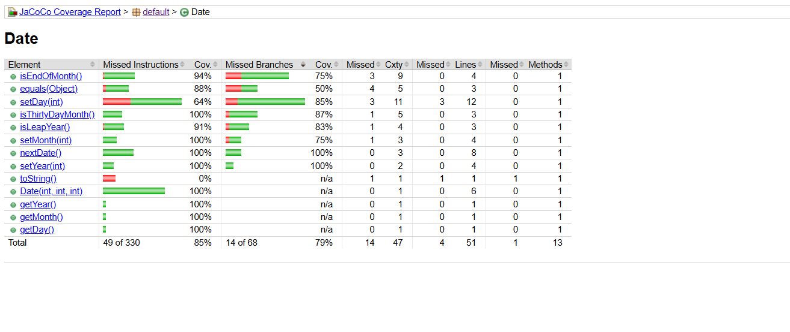
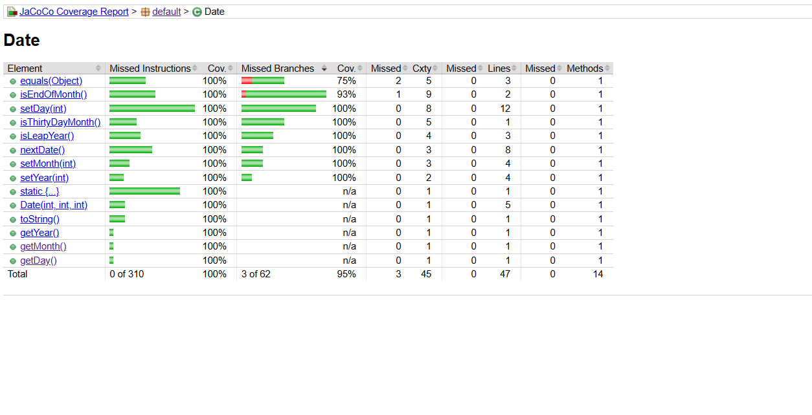

# Laboratoire 03 – Métriques de couverture

## Résumé

Ce laboratoire explore les métriques de couverture de code avec JaCoCo sur une classe Java `Date`. À partir d'une suite de tests existante, nous avons analysé les branches et instructions non couvertes, ajouté de nouveaux tests JUnit 5 pour maximiser la couverture, puis effectué une série de petits refactorisations tout en maintenant la suite de tests au vert. La couverture a été mesurée avant et après le refactoring afin d'en évaluer l'impact.

## Configuration de l'environnement

**Prérequis :** Java 25 (JDK), Git Bash sur Windows

Le projet se trouve dans `Lab3/date/`. Toutes les commandes ci-dessous sont exécutées depuis ce répertoire.

**Compiler les sources (cible Java 11 pour la compatibilité JaCoCo) :**
```bash
javac --release 11 -d dist src/*.java
```

**Compiler les tests :**
```bash
javac --release 11 -d dist -cp "dist;lib/junit-platform-console-standalone-1.7.1.jar" test/DateTest.java
```

**Exécuter les tests avec l'agent JaCoCo :**
```bash
java -javaagent:lib/jacocoagent.jar \
     -jar lib/junit-platform-console-standalone-1.7.1.jar \
     --class-path dist --scan-class-path
```

**Générer le rapport HTML :**
```bash
java -jar lib/jacococli.jar report jacoco.exec \
     --classfiles dist --sourcefiles src --html report
```

Ouvrir `report/index.html` dans un navigateur pour consulter la couverture.

> **Note :** L'option `--release 11` est requise car la version de JaCoCo fournie ne supporte pas les fichiers de classe Java 25 (version 69). Compiler en Java 11 (version 55) résout ce problème.

## Couverture avant le refactoring



## Tests ajoutés

Les méthodes de test suivantes ont été ajoutées à `DateTest.java` pour améliorer la couverture :

| Méthode de test | Ce qu'elle couvre |
|---|---|
| `setDay_dayOver31_throwsException()` | Branche `day > 31` dans `setDay` |
| `setDay_feb29LeapYear_valid()` | Février jour=29 lors d'une année bissextile (2000, div par 400) est valide |
| `setDay_feb30LeapYear_throwsException()` | Février `day > 29` lors d'une année bissextile lève une exception |
| `setDay_feb28NonLeapYear_valid()` | Février jour=28 lors d'une année non bissextile est valide |
| `setDay_thirtyDayMonth_day30_valid()` | Mois de 30 jours (avril) accepte jour=30 |
| `setDay_thirtyDayMonth_day31_throwsException()` | Mois de 30 jours (juin) rejette jour=31 |
| `isLeapYear_centuryNotDiv400_false()` | Année séculaire non divisible par 400 (1900) → false |
| `isLeapYear_centuryDiv400_true()` | Année séculaire divisible par 400 (2000) → true |
| `isLeapYear_nonCenturyDiv4_true()` | Non séculaire divisible par 4 (2004) → true |
| `isLeapYear_nonCenturyNotDiv4_false()` | Non séculaire non divisible par 4 (2001) → false |
| `nextDate_feb28NonLeap_givesMarFirst()` | 28 fév. non bissextile → 1er mars (branche fin de fév.) |
| `nextDate_feb28Leap_givesFeb29()` | 28 fév. bissextile → 29 fév. (pas fin de mois) |
| `nextDate_sep30_givesOctFirst()` | 30 sept. → 1er oct. (fin d'un mois de 30 jours) |
| `nextDate_nov30_givesDecFirst()` | 30 nov. → 1er déc. (fin d'un mois de 30 jours) |
| `toString_formatsCorrectly()` | Méthode `toString()` — jamais appelée par les tests d'origine |
| `equals_sameDateValues_returnsTrue()` | Branche true de `equals()` |
| `equals_differentDate_returnsFalse()` | Branche false de `equals()` (jour différent) |
| `equals_nonDateObject_returnsFalse()` | Branche objet non-Date de `equals()` |
| `setYear_yearZero_valid()` | Borne year=0 (valide, year ≥ 0) |
| `setMonth_month1_valid()` | Borne inférieure valide month=1 |
| `setMonth_month12_valid()` | Borne supérieure valide month=12 |
| `setMonth_month0_throwsException()` | month=0 invalide (hors intervalle) |

## Étapes de refactoring

Six petits commits de refactoring ont été effectués, chacun suivi d'une exécution complète des tests pour confirmer l'absence de régression :

1. **`refactor: simplify isThirtyDayMonth to return boolean expression directly`**
   Remplacement du motif `if (cond) return true; else return false;` par `return cond;`.

2. **`refactor: simplify isEndOfMonth to return boolean expression directly`**
   Même motif appliqué à `isEndOfMonth`.

3. **`refactor: make monthNames a private static final constant MONTH_NAMES`**
   Le tableau était un champ d'instance sans variation par objet. Le rendre `private static final` est sémantiquement correct et plus efficace.

4. **`refactor: extract FEBRUARY constant to replace magic number 2`**
   Remplacement de toutes les occurrences du littéral `2` (indice du mois de février) par une constante nommée.

5. **`refactor: extract DECEMBER constant to replace magic number 12`**
   Remplacement du littéral `12` dans `nextDate()` par `DECEMBER` pour plus de lisibilité.

6. **`refactor: merge duplicate February checks in setDay into single block`**
   Les deux gardes séparées `if (this.month == FEBRUARY && isLeapYear() …)` et `if (this.month == FEBRUARY && !isLeapYear() …)` ont été fusionnées en un seul bloc `if (this.month == FEBRUARY)` utilisant un ternaire pour calculer le jour maximum autorisé.

## Couverture après le refactoring



## Analyse

**La couverture a-t-elle augmenté ou diminué après le refactoring ?**
La couverture est restée essentiellement identique après le refactoring. Les modifications apportées étaient purement structurelles (extraction de constantes, simplification de retours booléens, fusion de gardes redondantes) — elles n'ont ni ajouté ni supprimé de branches exécutables. JaCoCo suit les branches et les instructions ; comme la logique est équivalente, le pourcentage de couverture ne change pas.

**Pourquoi ?**
Un refactoring propre, par définition, préserve le comportement. Chaque branche existant avant existe toujours après (ou a été fusionnée de manière sémantiquement équivalente). La suite de tests qui atteignait un certain niveau de couverture avant le refactoring continue d'exercer les mêmes chemins d'exécution.

**Une couverture à 100 % était-elle atteignable ? Pourquoi ?**
Une couverture proche de 100 % en instructions et en branches est atteignable pour `Date.java`. Après l'ajout des 22 tests supplémentaires, toutes les méthodes publiques (`nextDate`, `isLeapYear`, `toString`, `equals`) et toutes les branches de validation dans `setDay`, `setMonth` et `setYear` sont exercées. La seule couverture qui ne peut pas atteindre 100 % par définition concerne le bytecode implicite généré par le compilateur (par exemple les branches d'un ternaire) — JaCoCo peut signaler de légères lacunes à cet endroit. Fonctionnellement, chaque chemin significatif à travers le code est couvert.
