# SEG3503 - Lab 4 : Test-Driven Development

| Outline   | Value             |
| --------- | ----------------- |
| Course    | SEG 3503          |
| Date      | Summer 2026       |
| Student   | Alexandre Turgeon |
| Professor | Mouhcine Guennoun |
| TA        | Mohamed Nefsi     |

This lab uses the provided `fizzbuzz` and `tic` Elixir projects to practise the
TDD cycle: RED, GREEN, and REFACTOR. The work is located in
`Teamwork/seg3503_playground/Lab4`.

## Test Results

Commands executed from each project directory:

```powershell
cd Lab4/fizzbuzz
mix test
mix format --check-formatted

cd ../tic
mix test
mix format --check-formatted
```

Verified results:

- `fizzbuzz`: 11 tests, 0 failures
- `tic`: 19 tests, 0 failures
- `mix format --check-formatted`: passes for both projects

## TDD Commit Groups

Each group identifies a failing test commit, the implementation commit that makes
it pass, and a refactor commit where the tests still pass.

| Group                                    | RED       | GREEN     | REFACTOR  |
| ---------------------------------------- | --------- | --------- | --------- |
| 1 - FizzBuzz rejects non-positive values | `497fed7` | `f4e0309` | `7438826` |
| 2 - FizzBuzz validates ranges            | `b2079f0` | `9de7732` | `137a43b` |
| 3 - Tic creates boards and places marks  | `c47e566` | `4e745a0` | `812d7ca` |
| 4 - Tic rejects invalid moves            | `f1cc245` | `41ccf13` | `8164e31` |
| 5 - Tic detects winners and draws        | `7d21f13` | `4dab612` | `22afadf` |

Support commits:

- `4cb3a83` restored the corrupted Tic `mix.exs` file.
- `ec569a8` restored the corrupted Tic test helper and normalized Windows
  line endings in expected strings.
- `c578e5d` formatted the Elixir projects.

---

# Wissam Elmasry

| Outline | Value |
| --- | --- |
| Course | SEG 3503 |
| Date | Summer 2026 |
| Student | Wissam Elmasry |
| Professor | Mouhcine Guennoun |
| TA | Mohamed Nefsi |

My TDD work is implemented in **Java / JUnit 5**, built test-first on the
provided sample at `Lab4/tic/tic_java_sample_code` (`Tic.java` + `TicTest.java`).

Tests run with the JUnit 5 console launcher:

```powershell
cd Lab4/tic/tic_java_sample_code
javac -cp lib/junit-platform-console-standalone-1.11.3.jar -d bin Tic.java TicTest.java
java -jar lib/junit-platform-console-standalone-1.11.3.jar execute --class-path bin --select-class tic.TicTest
```

Final result: **6 tests found, 6 successful, 0 failed.**

| Commit group / names                                                                                    | Commit number (hash)                                   | Description                                                                                                                                                                                                                                                                                                                                                                                                                       |
| ------------------------------------------------------------------------------------------------------- | ------------------------------------------------------ | --------------------------------------------------------------------------------------------------------------------------------------------------------------------------------------------------------------------------------------------------------------------------------------------------------------------------------------------------------------------------------------------------------------------------------- |
| Board initializes empty<br>(red board initializes empty cells, green cellAt accessor)                   | RED `699e559`<br>GREEN `681b88e`                       | RED writes `freshBoardCellsAreEmpty()`, asserting a new 3×3 board reads the empty marker `"_"` at every cell through a `cellAt(row,col)` accessor that does not exist yet (fails to compile).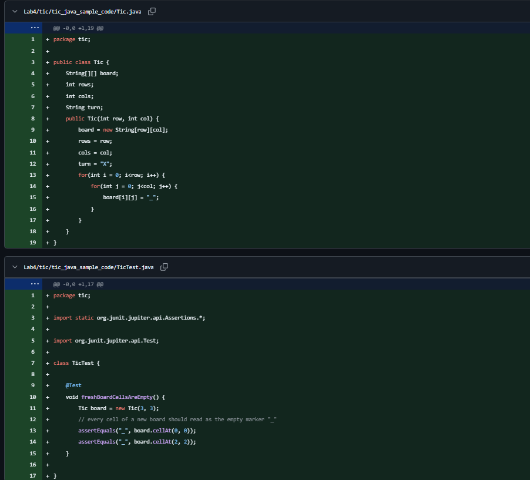 <br>GREEN adds `cellAt(row,col)` returning `board[row][col]`, so the test passes. 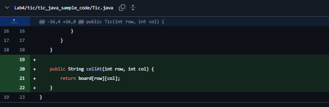                                                                                                    |
| Place a mark<br>(red place a mark on the board, green place writes current player's mark)               | RED `ca93007`<br>GREEN `c5be50a`                       | RED writes `placingMarkFillsCell()`, expecting `place(1,1)` to write `"X"` since X moves first; `place()` does not exist.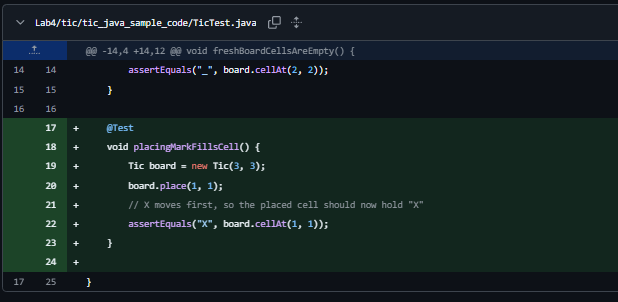 <br>GREEN adds `place(row,col)` that writes the current player's mark into the chosen cell.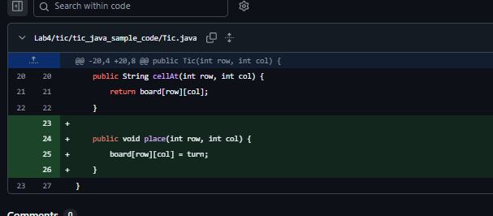                                                                                                                                                             |
| Turn alternates X/O<br>(red turn alternates between players, green alternate turns after each move)     | RED `c25e8a0`<br>GREEN `b1afa8d`                       | RED writes `turnAlternatesBetweenPlayers()`, expecting `currentPlayer()` to report `X`, then `O`, then `X`; the accessor is missing and `place()` does not switch turns.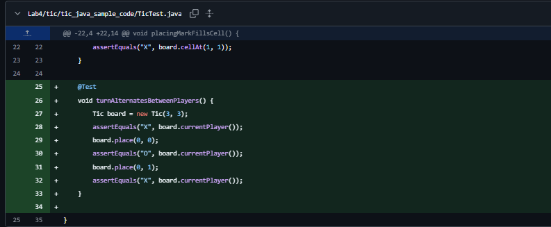 <br>GREEN adds `currentPlayer()` and makes `place()` flip X↔O after each move.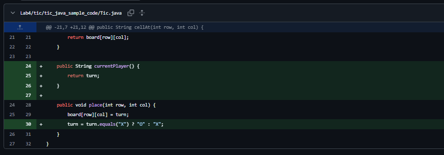                                                                                                                           |
| Reject occupied move<br>(red reject move on an occupied cell, green reject occupied-cell moves)         | RED `f9e6fd3`<br>GREEN `4994ffe`                       | RED writes `placingOnOccupiedCellIsRejected()`, expecting a move on a taken cell to throw `IllegalStateException` without consuming the turn; `place()` currently overwrites silently (JUnit assertion fails). 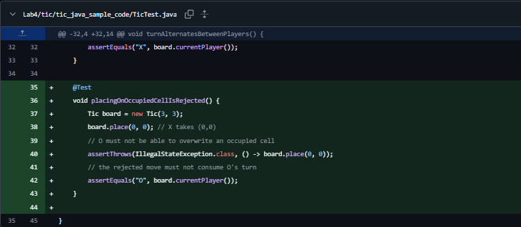 <br>GREEN guards `place()` to throw when the target cell is not `"_"`, before writing or switching turns. 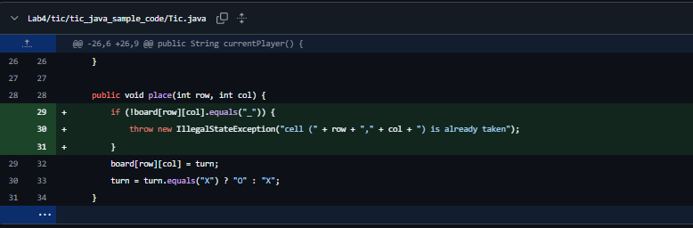                                                        |
| Detect a row win<br>(red detect a row win, green detect a row win, refactor extract winnerOfRow helper) | RED `a58ddba`<br>GREEN `5593de1`<br>REFACTOR `290e8d8` | RED writes `detectsRowWin()` (X completes the top row → `winner()` returns `"X"`) and `noWinnerYetReturnsUnderscore()` (incomplete board → `"_"`); `winner()` does not exist.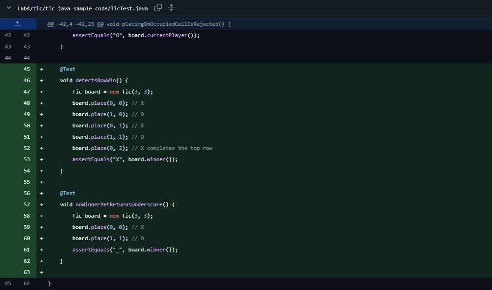 <br>GREEN adds `winner()` that scans each row and returns the shared mark, else `"_"`.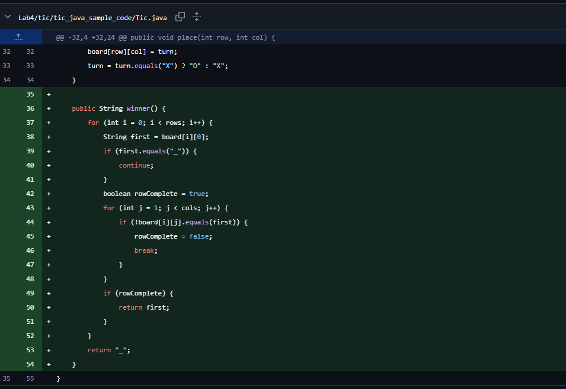 <br>REFACTOR extracts a `winnerOfRow(i)` helper while keeping all six tests green. 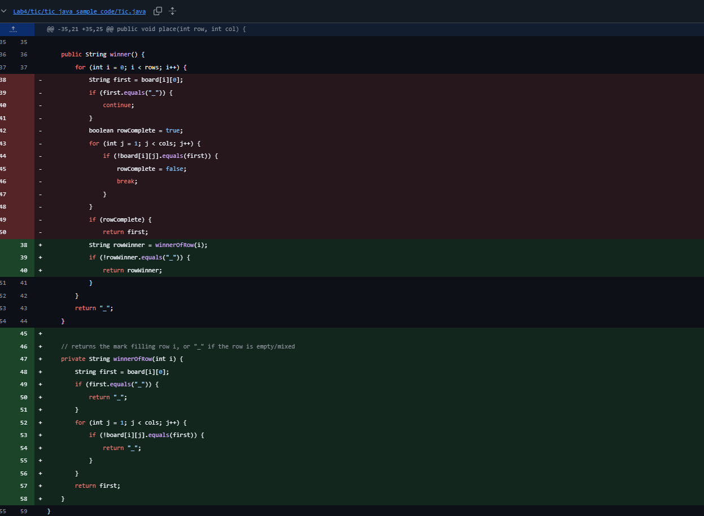 |
