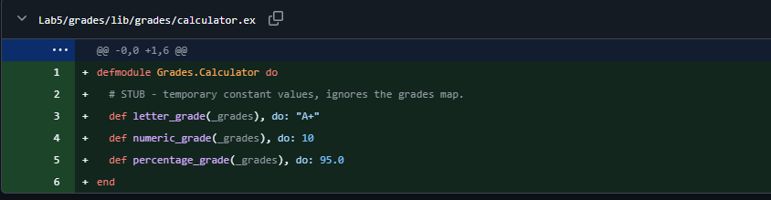
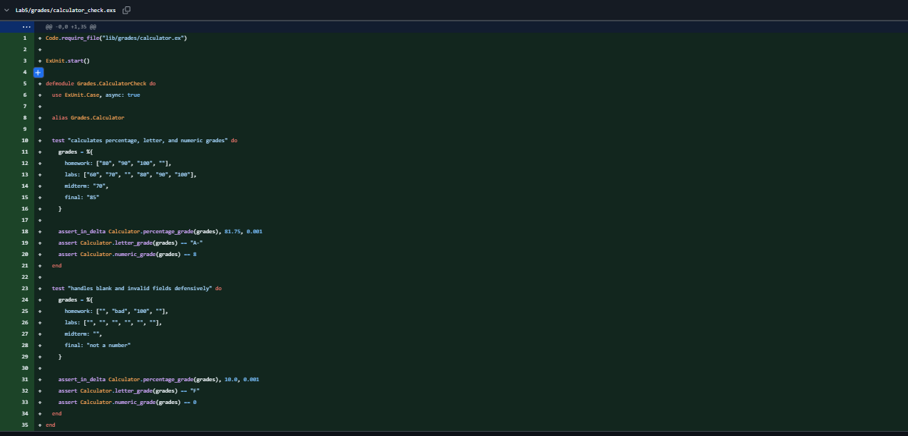
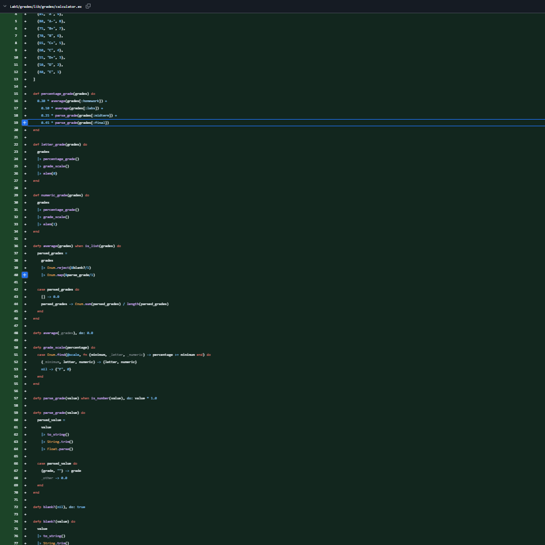
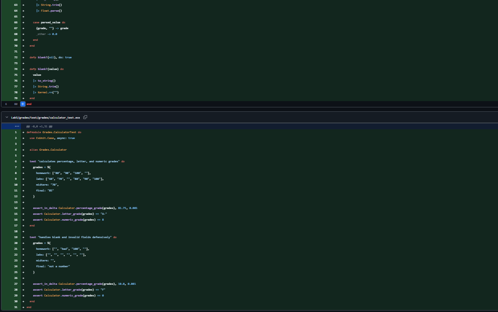
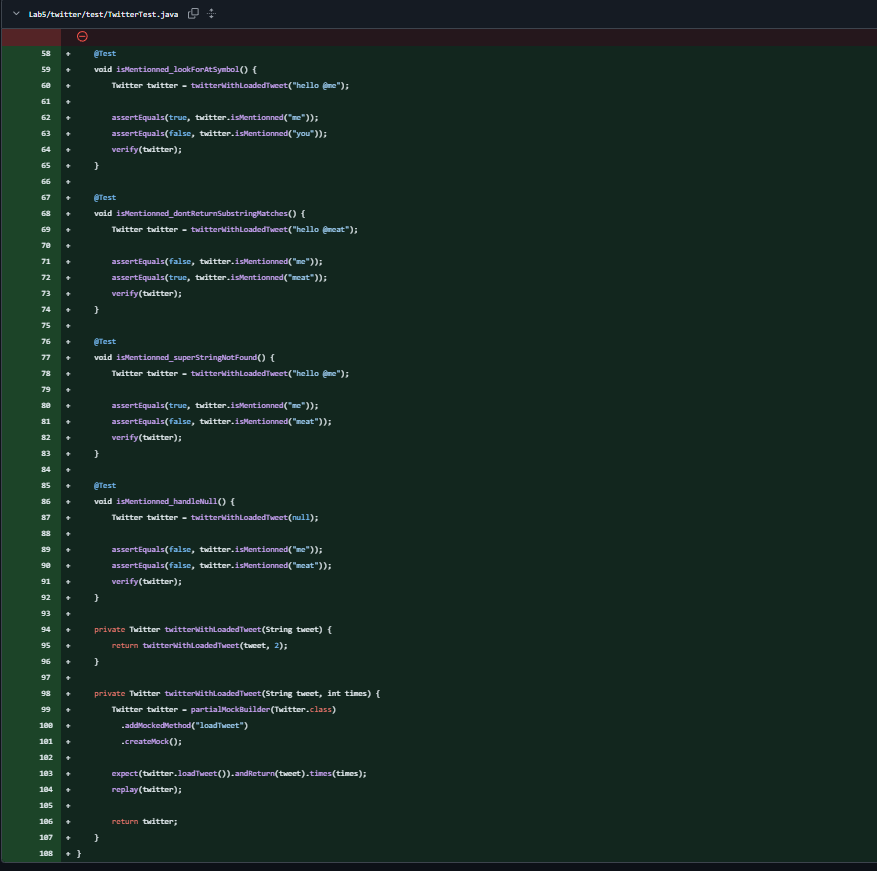
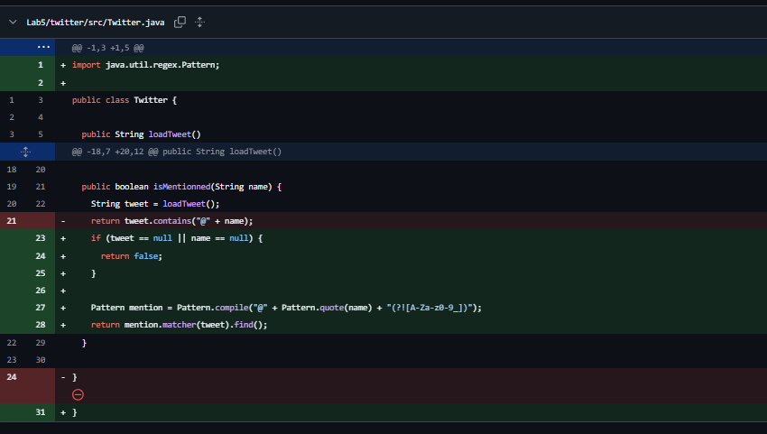
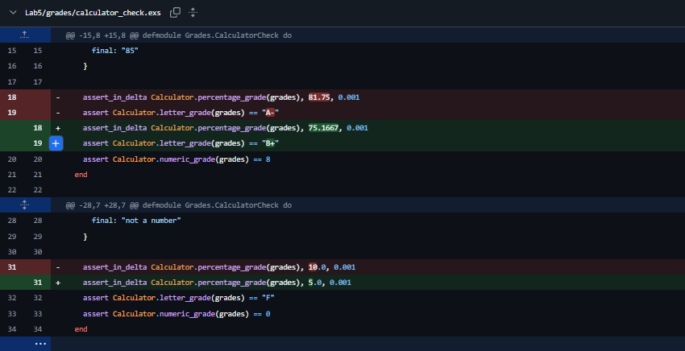
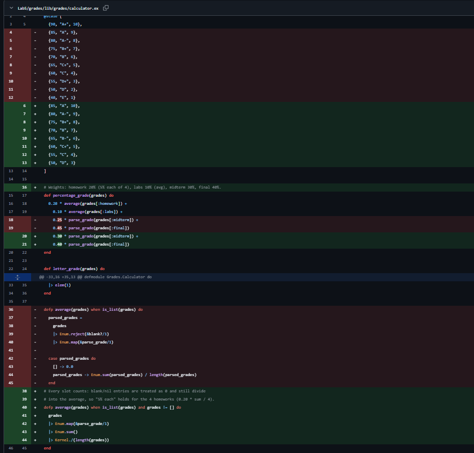
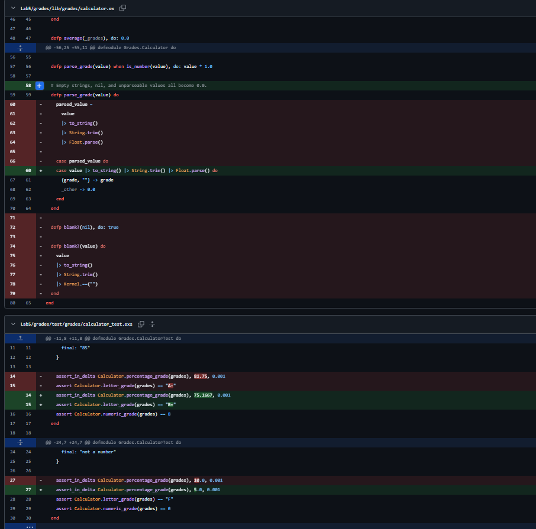

# SEG3503 - Lab 5 : Stubs, Mocks, and Architecture

| Outline   | Value             |
| --------- | ----------------- |
| Course    | SEG 3503          |
| Date      | Summer 2026       |
| Student   | Alexandre Turgeon |
| Professor | Mouhcine Guennoun |
| TA        | Mohamed Nefsi     |

This lab uses the provided `grades` and `twitter` starter projects to practise
temporary stubs, mock collaborators, and small architectural choices that make
logic easier to test. The work is located in
`Teamwork/seg3503_playground/Lab5`.

## Setup Notes

The starter zips were extracted into:

```text
Lab5/
+-- grades/
+-- twitter/
```

The zip metadata directories/files (`__MACOSX`, `.DS_Store`) were removed, and
the redundant `twitter/lib/easymock-4.3-bundle.zip` was removed while keeping
`twitter/lib/easymock-4.3.jar`.

The `grades` project is a legacy Phoenix 1.5 / LiveView 0.15 project. The full
`mix test` / `mix compile` tasks require fetching the Phoenix dependencies with
Hex, which is not installed in this environment, so those tasks stop with
`Could not find an SCM for dependency :phoenix`.

For that reason, the grade calculation is kept in the pure module
`Grades.Calculator` and is verified with the standalone `calculator_check.exs`
runner, which uses only ExUnit and does **not** boot Phoenix or need any
dependencies. On Erlang/OTP 28 + Elixir 1.19 this runner passes both tests:

```powershell
cd Lab5/grades
elixir calculator_check.exs
# => 2 tests, 0 failures
```

Once Hex and the Phoenix deps are available (`mix local.hex --force` then
`mix deps.get`), the same assertions also run under `mix test`.

The `twitter` project has Windows launchers in addition to the original bash
scripts:

```powershell
cd Lab5/twitter
.\bin\test.ps1
```

```cmd
cd Lab5\twitter
bin\test.bat
```

Both Windows scripts use `;` classpath separators and pass
`--add-opens java.base/java.lang=ALL-UNNAMED`, which EasyMock 4.3 needs on
modern Java versions.

## Grades

### Stub

The temporary calculator stub returned fixed values:

```elixir
defmodule Grades.Calculator do
  # STUB - temporary constant values, ignores the grades map.
  def letter_grade(_grades), do: "A+"
  def numeric_grade(_grades), do: 10
  def percentage_grade(_grades), do: 95.0
end
```

Observation: with the stub, the LiveView can call the missing module, but every
input produces the same `A+`, `10`, and `95.0`. This is useful for unblocking UI
work, but it does not validate parsing, weighting, blanks, or grade boundaries.

### Real Calculation

The real calculator expects the map built by `GradesWeb.PageLive`:

```elixir
%{
  homework: ["...", "...", "...", "..."],
  labs: ["...", "...", "...", "...", "...", "..."],
  midterm: "...",
  final: "..."
}
```

Every slot counts: blank/`nil` entries are treated as `0.0` and still divide
into the list average, so "5% each" holds for the four homeworks
(`0.20 * sum / 4`). Nonblank invalid entries (e.g. `"bad"`) also parse as `0.0`,
as do blank or invalid midterm/final values.

Weights: homework 20% (5% each of 4), labs 10% (avg), midterm 30%, final 40%.

Formula:

```text
percentage =
  0.20 * avg(homework) +
  0.10 * avg(labs) +
  0.30 * midterm +
  0.40 * final
```

Scale:

| Percentage | Letter | Numeric |
| ---------- | ------ | ------- |
| 90+        | A+     | 10      |
| 85-89      | A      | 10      |
| 80-84      | A-     | 9       |
| 75-79      | B+     | 8       |
| 70-74      | B      | 7       |
| 65-69      | B-     | 6       |
| 60-64      | C+     | 5       |
| 55-59      | C      | 4       |
| 50-54      | D      | 3       |
| below 50   | F      | 0       |

Worked example from the tests:

| Component | Values                       | Result                                       |
| --------- | ---------------------------- | -------------------------------------------- |
| Homework  | `80, 90, 100, blank`         | `[80, 90, 100, 0]`, average `67.5`           |
| Labs      | `60, 70, blank, 80, 90, 100` | `[60, 70, 0, 80, 90, 100]`, average `66.667` |
| Midterm   | `70`                         | `70.0`                                       |
| Final     | `85`                         | `85.0`                                       |

```text
0.20*67.5 + 0.10*66.667 + 0.30*70 + 0.40*85 = 75.167
```

Expected result: `75.17`, `B+`, numeric grade `8`.

Verification files:

- `grades/test/grades/calculator_test.exs`
- `grades/calculator_check.exs`

Verification command (no dependencies required):

```powershell
cd Lab5/grades
elixir calculator_check.exs
# => 2 tests, 0 failures
```

The same assertions live in `test/grades/calculator_test.exs` and run under
`mix test` once Hex and the Phoenix deps are installed.

## Twitter

The Twitter starter has a slow/random `loadTweet()` collaborator. The mock tests
replace only that collaborator so `isMentionned` can be tested deterministically.
The extracted `actual_call()` test also depended on the random tweet and failed
on the first Windows-script run, so it was stabilized with the same partial-mock
helper before the red bug tests were recorded.

### Mock Tests

| Test                                      | Mocked `loadTweet()`  | Expected assertions      |
| ----------------------------------------- | --------------------- | ------------------------ |
| `isMentionned_lookForAtSymbol`            | `"hello @me"` twice   | `me` true, `you` false   |
| `isMentionned_dontReturnSubstringMatches` | `"hello @meat"` twice | `me` false, `meat` true  |
| `isMentionned_superStringNotFound`        | `"hello @me"` twice   | `me` true, `meat` false  |
| `isMentionned_handleNull`                 | `null` twice          | `me` false, `meat` false |

### Results

| Stage                  | Command          | Result                                                                                             |
| ---------------------- | ---------------- | -------------------------------------------------------------------------------------------------- |
| Starter Windows script | `.\bin\test.ps1` | Script compiled and ran; random `actual_call()` failed this run with `expected true but was false` |
| Red mock tests         | `.\bin\test.ps1` | 7 tests, 5 passed, 2 failed                                                                        |
| Green fix              | `.\bin\test.ps1` | 7 tests, 7 passed, 0 failed                                                                        |

Red failures:

- `isMentionned_dontReturnSubstringMatches`: `@meat` matched `me` because the
  original code used `tweet.contains("@" + name)`.
- `isMentionned_handleNull`: `loadTweet()` could return `null`, causing a
  `NullPointerException` before any assertion could complete.

Fix:

```java
if (tweet == null || name == null) {
  return false;
}

Pattern mention = Pattern.compile("@" + Pattern.quote(name) + "(?![A-Za-z0-9_])");
return mention.matcher(tweet).find();
```

The null guard handles missing tweets. `Pattern.quote(name)` avoids treating a
name as regex syntax, and the negative lookahead prevents `@meat` from matching
the requested username `me`.

## Alexandre Turgeon — Commit Map

The Elixir `grades` calculator, the Java `twitter` mock tests, the
`isMentionned` fix, and the initial documentation above were built by Alexandre
Turgeon.

Each code commit below is shown with a screenshot of what changed in that commit
(`git show <hash>`).

| Step | Commit    | Description                                           | What changed |
| ---- | --------- | ----------------------------------------------------- | ------------ |
| 1    | `3d720a6` | Add Lab5 grades starter                               | Provided Phoenix starter files (no code screenshot). |
| 2    | `b326eb4` | Add grades calculator stub                            |  |
| 3    | `83eaa1d` | Implement grades calculator                           | <br><br> |
| 4    | `a9b6c42` | Add Lab5 twitter starter                              | Provided Java starter files (no code screenshot). |
| 5    | `aee9ff2` | Add twitter mention mock tests                        |  |
| 6    | `1a43957` | Fix twitter mention matching                          |  |
| 7    | `327085d` | Document setup, observations, results, and commit map | README only (no code screenshot). |

---

# Wissam Elmasry

| Outline   | Value             |
| --------- | ----------------- |
| Course    | SEG 3503          |
| Date      | Summer 2026       |
| Student   | Wissam Elmasry    |
| Professor | Mouhcine Guennoun |
| TA        | Mohamed Nefsi     |

I reviewed the `grades` and `twitter` work and aligned the grade calculator with
the University of Ottawa scale specified for this lab:

- **Weights** were changed to homework 20% (5% each), labs 10%, midterm 30%,
  final 40% (previously 25% / 45% for midterm/final).
- **Scale / numeric points** were changed to A+/A = 10, A- = 9, B+ = 8, B = 7,
  B- = 6, C+ = 5, C = 4, D = 3, and F = 0 below 50%, replacing the earlier
  A+..E scale.
- **Blank handling** now treats empty strings and `nil` as `0` while still
  dividing across every slot, so a blank homework counts as a real zero.

I updated `test/grades/calculator_test.exs` and `calculator_check.exs` to the
new expected values and verified both suites:

| Suite               | Command                       | Result              |
| ------------------- | ----------------------------- | ------------------- |
| Grades (standalone) | `elixir calculator_check.exs` | 2 tests, 0 failures |
| Twitter (Java)      | `bin\test.bat`                | 7 tests, 0 failures |

The worked example now yields `75.17`, `B+`, numeric `8`; the defensive case
(only a single `100` homework, everything else blank/invalid) yields `5.0`, `F`,
numeric `0`.

Verification runs after my changes are shown in the **Grades** and **Twitter**
sections above (`calculator_check.exs` → 2 tests, 0 failures; `bin\test.ps1` →
7 tests, 0 failures).

| Commit    | Description                                                                                              | What changed |
| --------- | -------------------------------------------------------------------------------------------------------- | ------------ |
| `24abb0e` | Align grades calculator with the lab's uOttawa scale (weights, scale, blank-as-0), update tests and docs | <br><br> |
| `52e3bab` | Add Wissam Elmasry to the Lab5 README                                                                    | README only (no code screenshot). |
