# SEG 3503 - Lab 6-7: Automated User Acceptance Tests with Selenium WebDriver

| Outline    | Value                                                           |
| ---------- | --------------------------------------------------------------- |
| Course     | SEG 3503 - Software Quality Assurance                           |
| Lab        | 06/07 - Automated user acceptance tests with Selenium WebDriver |
| Students   | Wissam Elmasry, Alexandre Turgeon                               |
| Professor  | Mouhcine Guennoun                                               |
| TA         | Mohamed Nefsi                                                   |
| Date       | 26 July 2026                                                    |
| Repository | `seg3503_playground/Lab6`                                       |

---

## 1. What this lab does

The lab drives the provided **YAMAZONE BookStore** web application with **Selenium
WebDriver** from a **Maven** project. The application is a Spring Boot server
bundled as `bookstore5.jar` and served at `http://localhost:8080`; the tests start
that server, open Chrome, and assert on the rendered pages.

```text
Lab6/
+-- BookstoreApp/                 # the Maven project (extracted from BookstoreApp.zip)
|   +-- bookstore5.jar            # the bundled Spring Boot server
|   +-- pom.xml
|   +-- src/main/java/main/App.java            # launcher packaged into the project jar
|   +-- src/test/java/
|       +-- ExampleTest.java                   # provided starter test (plain JUnit)
|       +-- selenium/ExampleSeleniumTest.java  # provided starter test (Selenium)
|       +-- selenium/CategorySearchTest.java   # added - catalogue search (F2)
|       +-- selenium/OrderAcceptanceTest.java  # added - ordering and checkout (F3-F6)
|       +-- selenium/AdminAcceptanceTest.java  # added - sign in and catalogue admin (F1, F7, F8)
|       +-- selenium/ServerControl.java        # shared server bootstrap helper
|       +-- selenium/Screenshots.java          # saves the application screenshots below
+-- assets/                       # screenshots + captured mvn output
+-- README.md
```

## 2. Output of `mvn --version`

```bash
cd Lab6/BookstoreApp
mvn --version
```

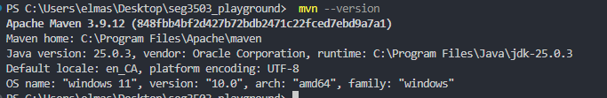

This shows the Maven, JDK and OS versions the lab was run with. On this machine
Maven 3.9.12 runs on Oracle JDK 25.0.3 under Windows 11.

```text
Apache Maven 3.9.12 (848fbb4bf2d427b72bdb2471c22fced7ebd9a7a1)
Maven home: C:\Program Files\Apache\maven
Java version: 25.0.3, vendor: Oracle Corporation, runtime: C:\Program Files\Java\jdk-25.0.3
Default locale: en_CA, platform encoding: UTF-8
OS name: "windows 11", version: "10.0", arch: "amd64", family: "windows"
```

## 3. Output of `mvn compile`

```bash
mvn compile
```

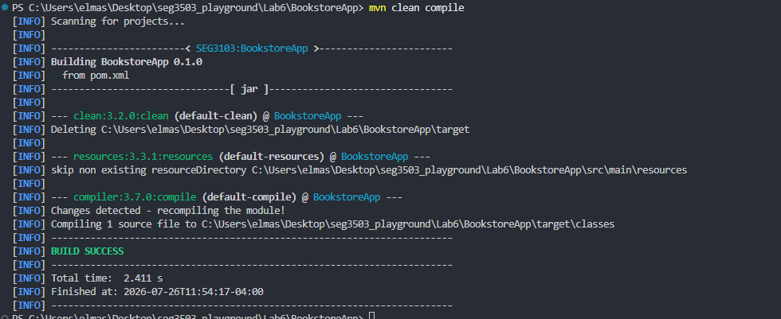

`mvn compile` compiles `src/main/java` into `target/classes`. The `pom.xml` still
targets Java 1.8, which JDK 25 accepts, and the build ends in `BUILD SUCCESS`.

```text
[INFO] --- compiler:3.7.0:compile (default-compile) @ BookstoreApp ---
[INFO] Compiling 1 source file to C:\...\Lab6\BookstoreApp\target\classes
[INFO] ------------------------------------------------------------------------
[INFO] BUILD SUCCESS
[INFO] ------------------------------------------------------------------------
```

## 4. Output of `mvn package -DskipTests`

```bash
mvn package -DskipTests
```

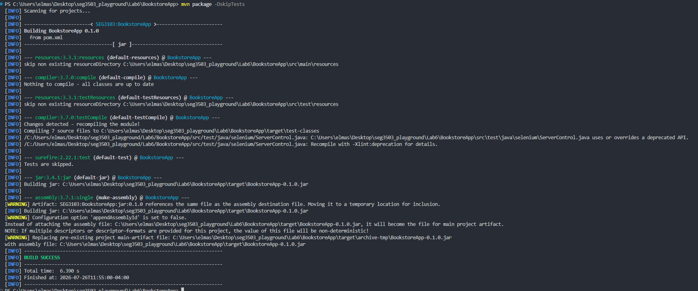

`package` runs the whole build up to and including packaging: it compiles the
main and test sources, then the `maven-assembly-plugin` bundles the classes and
all of the project's dependencies into a single executable jar,
`target/BookstoreApp-0.1.0.jar` (about 32 MB), with `main.App` as its main class.
`-DskipTests` still _compiles_ the tests but does not _run_ them, so the packaging
is not slowed down by the browser tests.

```text
[INFO] --- jar:3.4.1:jar (default-jar) @ BookstoreApp ---
[INFO] --- assembly:3.7.1:single (make-assembly) @ BookstoreApp ---
[INFO] Building jar: C:\...\Lab6\BookstoreApp\target\BookstoreApp-0.1.0.jar
[INFO] BUILD SUCCESS
```

## 5. Output of `java -jar ./target/BookstoreApp-0.1.0.jar`

```bash
java -jar ./target/BookstoreApp-0.1.0.jar
# then browse to http://localhost:8080/ and http://localhost:8080/admin
# press Enter in the terminal to stop the server
```

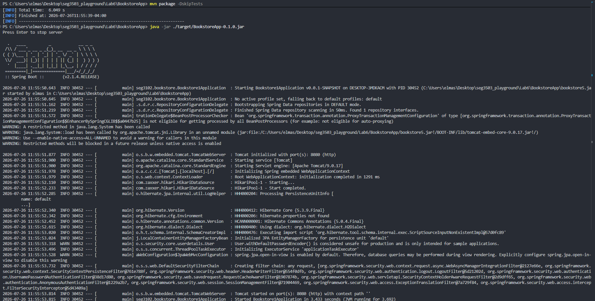

The project jar is only a launcher: `main.App` starts `bookstore5.jar` in a child
process and waits for Enter to shut it down. The Spring Boot log is printed in the
same terminal and ends with `Tomcat started on port(s): 8080 (http)`, after which
`http://localhost:8080/` answers `200` and `http://localhost:8080/admin` redirects
to the sign in page.

**Note - both jars are needed.** `BookstoreApp-0.1.0.jar` does not contain the web
application; it launches `bookstore5.jar`, which must therefore stay next to the
`pom.xml` and the command must be run from `Lab6/BookstoreApp`. Running
`java -jar bookstore5.jar` directly serves the same application.

**Note - one fix was required here**, see section 10.

## 6. The running application

These eight screenshots are written by the test run itself (`Screenshots.save`,
called from the test classes), so they always match the version of the
application that was tested.

### Storefront - `http://localhost:8080/`


### Catalogue search for the category `tech` (F2, UC4)

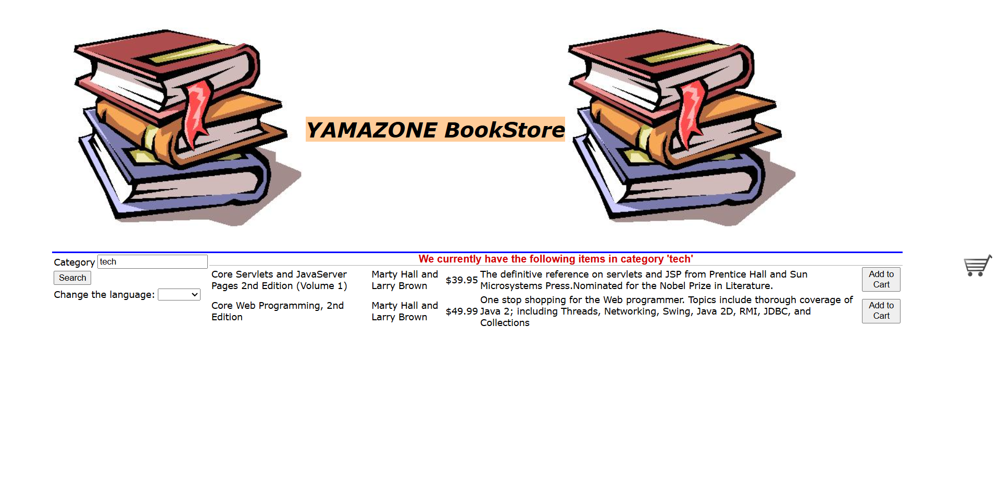

### Shopping cart after ordering a book (F3, F4, UC6, UC7)

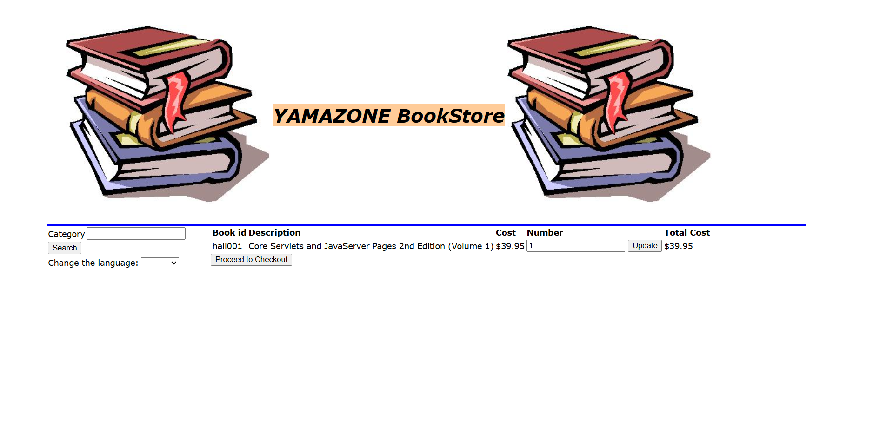

### Checkout page with taxes and shipping (F6, UC9)

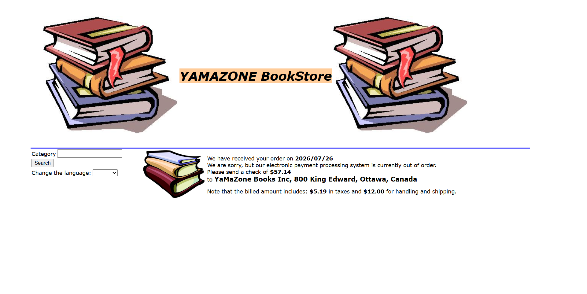

### Admin sign in - `http://localhost:8080/admin` (F8, UC1)


### Admin sign in refused with wrong credentials (UC1 step 3.a)


### Admin operations page after signing in as `admin` / `password`

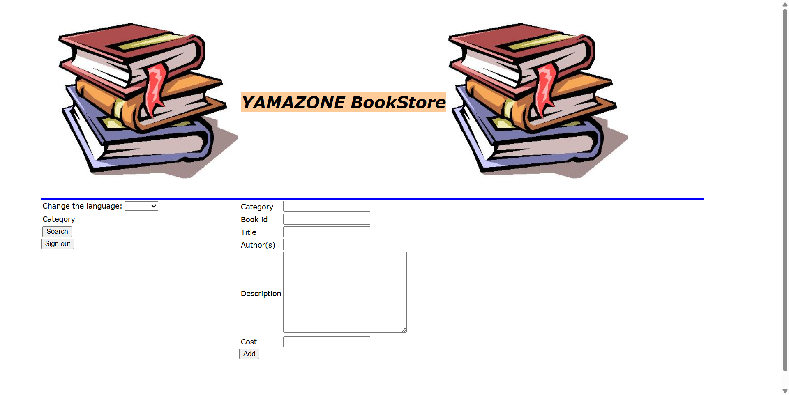

### A book added by the admin, seen in the customer catalogue (F1, UC3)

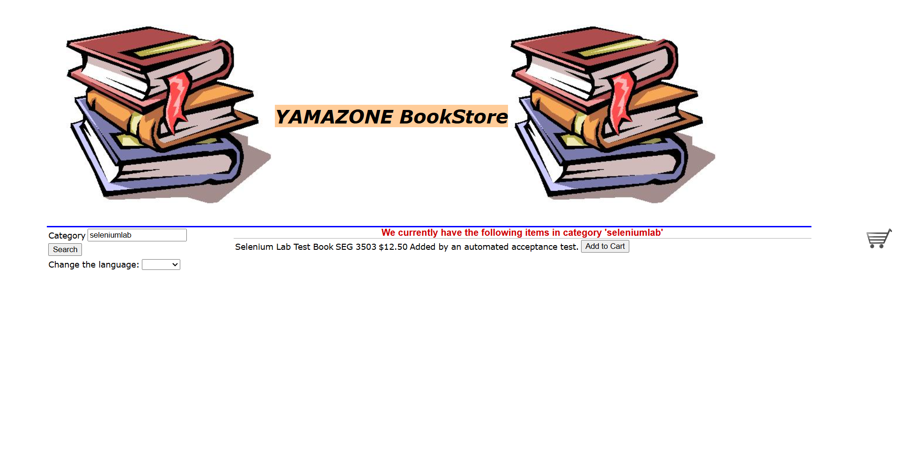

## 7. Output of `mvn test` before the additional tests

The two test classes shipped with the lab are `ExampleTest` and
`ExampleSeleniumTest`, three tests in total. They can be run on their own to
reproduce the starting point:

```bash
mvn test "-Dtest=ExampleTest,ExampleSeleniumTest"
```

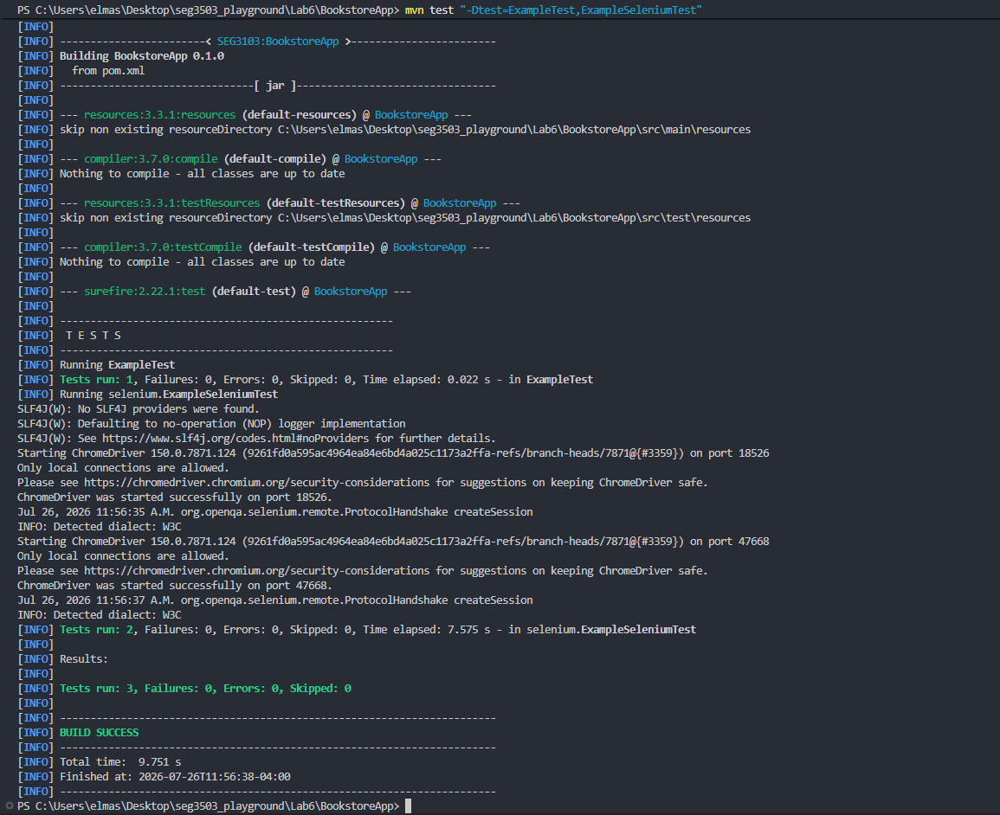

```text
[INFO] Running ExampleTest
[INFO] Tests run: 1, Failures: 0, Errors: 0, Skipped: 0, Time elapsed: 0.021 s - in ExampleTest
[INFO] Running selenium.ExampleSeleniumTest
[INFO] Tests run: 2, Failures: 0, Errors: 0, Skipped: 0, Time elapsed: 7.046 s - in selenium.ExampleSeleniumTest
[INFO] Tests run: 3, Failures: 0, Errors: 0, Skipped: 0
[INFO] BUILD SUCCESS
```

Full console output: [`assets/mvn-test-baseline-output.txt`](assets/mvn-test-baseline-output.txt).

## 8. The additional Selenium WebDriver tests

Twelve tests were added on top of the three provided ones, in three classes under
`src/test/java/selenium/`. Every test maps to a numbered requirement or use case
of `bookStoreRequirements.pdf` and carries a Javadoc comment naming it.

**`OrderAcceptanceTest.java`**

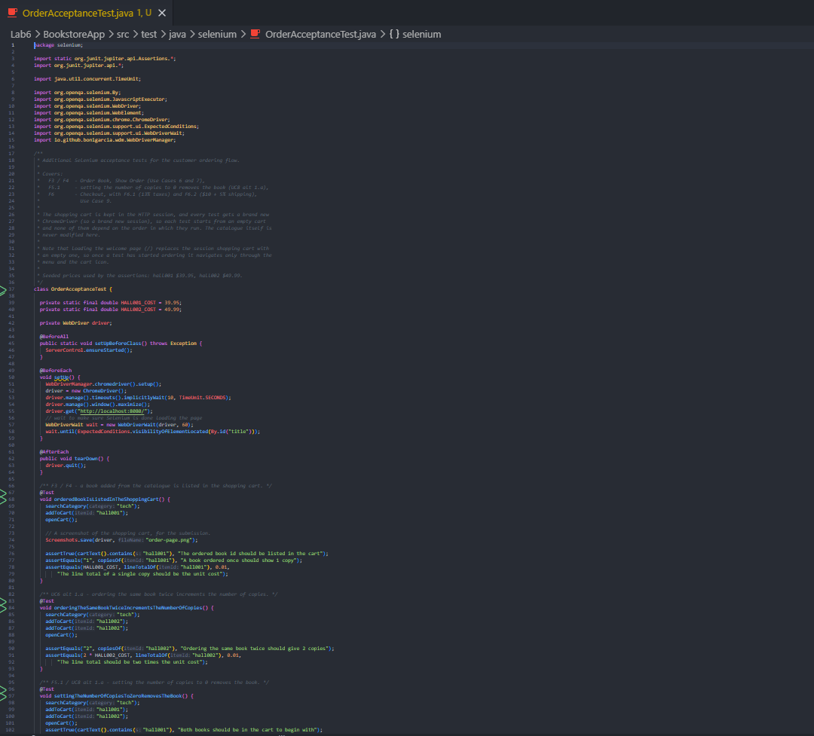

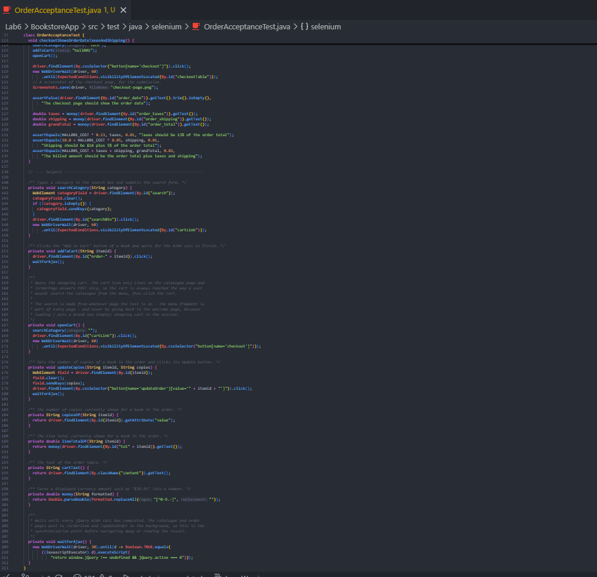

**`AdminAcceptanceTest.java`**

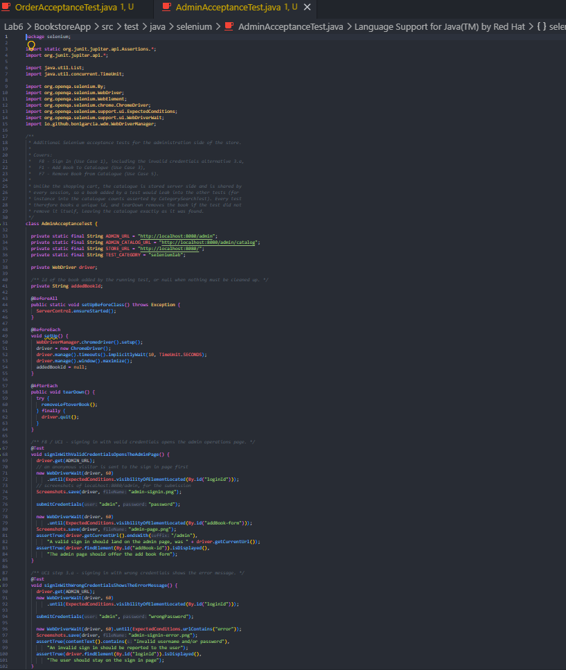

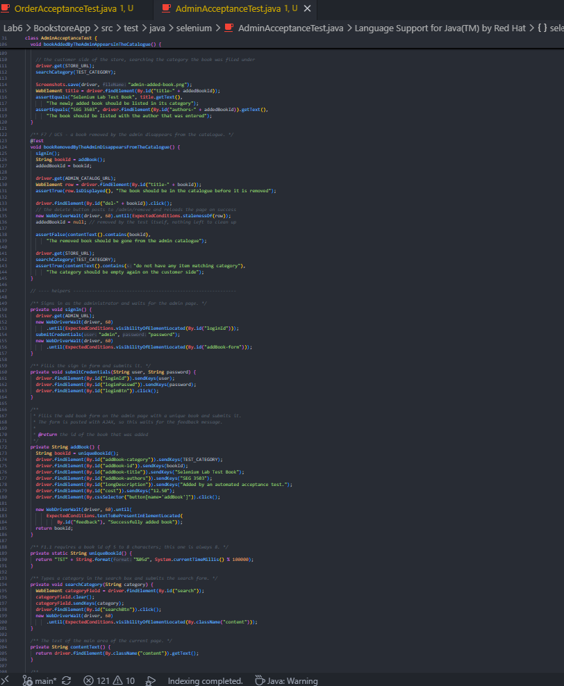

### `CategorySearchTest` - Browse Catalogue

| Test                                       | Requirement        | Assertion                                                                      |
| ------------------------------------------ | ------------------ | ------------------------------------------------------------------------------ |
| `searchByCategoryTechReturnsMatchingBooks` | F2.1, UC4          | `tech` returns exactly 2 books (`hall001`, `hall002`)                          |
| `searchByCategoryKidsReturnsMatchingBooks` | F2.1, UC4          | `kids` returns exactly 3 books                                                 |
| `emptyCategoryReturnsWholeCatalogue`       | F2.2, UC4 step 1.a | an empty category returns all 5 books                                          |
| `unknownCategoryShowsNoMatchMessage`       | UC4 step 1.b       | an unknown category shows the "do not have any item matching category" message |

### `OrderAcceptanceTest` - ordering and checkout

| Test                                                  | Requirement         | Assertion                                                                                                  |
| ----------------------------------------------------- | ------------------- | ---------------------------------------------------------------------------------------------------------- |
| `orderedBookIsListedInTheShoppingCart`                | F3, F4, UC6, UC7    | the ordered book id is listed in the cart, with 1 copy and its unit cost                                   |
| `orderingTheSameBookTwiceIncrementsTheNumberOfCopies` | UC6 step 1.a        | ordering twice shows 2 copies and twice the cost                                                           |
| `settingTheNumberOfCopiesToZeroRemovesTheBook`        | F5.1, UC8 step 1.a  | 0 copies removes that book and leaves the other one                                                        |
| `checkoutShowsOrderDateTaxesAndShipping`              | F6, F6.1, F6.2, UC9 | the checkout page shows the date, taxes of 13%, shipping of $10 + 5%, and a grand total equal to their sum |

### `AdminAcceptanceTest` - administration

| Test                                              | Requirement  | Assertion                                                                                                     |
| ------------------------------------------------- | ------------ | ------------------------------------------------------------------------------------------------------------- |
| `signInWithValidCredentialsOpensTheAdminPage`     | F8, UC1      | `admin` / `password` lands on `/admin` and shows the add book form                                            |
| `signInWithWrongCredentialsShowsTheErrorMessage`  | UC1 step 3.a | a wrong password shows "Invalid username and/or password" and stays on the sign in page                       |
| `bookAddedByTheAdminAppearsInTheCatalogue`        | F1, UC3      | a book added by the admin is found by a customer catalogue search, with the right title and author            |
| `bookRemovedByTheAdminDisappearsFromTheCatalogue` | F7, UC5      | after deletion the book is gone from the admin catalogue and its category is empty again on the customer side |

Notes on how the tests are written:

- Elements are located **by id** wherever the application provides one
  (`#search`, `#searchBtn`, `#cartLink`, `#order-<bookId>`, `#title-<bookId>`,
  `#del-<bookId>`, `#loginId`, `#loginPasswd`, `#loginBtn`, `#addBook-*`,
  `#order_taxes`, `#order_shipping`, `#order_total`), falling back to a CSS
  selector on `name`/`value` for the buttons that have no id. No absolute XPath
  is used. The ids were read from the application's Thymeleaf templates and from
  the rendered HTML, not guessed.
- Synchronisation is done with `WebDriverWait` and `ExpectedConditions`. The
  catalogue and order pages post to `/orderItem` and `/updateOrder` with jQuery in
  the background, so `OrderAcceptanceTest` waits on `jQuery.active === 0` before
  navigating. There is no `Thread.sleep` in the tests.
- **Every test is independent and rerunnable.** The shopping cart lives in the
  HTTP session and each test gets a fresh `ChromeDriver`, so carts never leak
  between tests. The catalogue is shared by all sessions, so `AdminAcceptanceTest`
  books a unique id (`TST` + 5 digits, 8 characters, respecting the 5-8 character
  rule of F1.1) and deletes it again in `tearDown`, leaving the catalogue exactly
  as it was found.

## 9. Output of `mvn test` with the additional tests

```bash
mvn test          # the app is started by the tests themselves
```

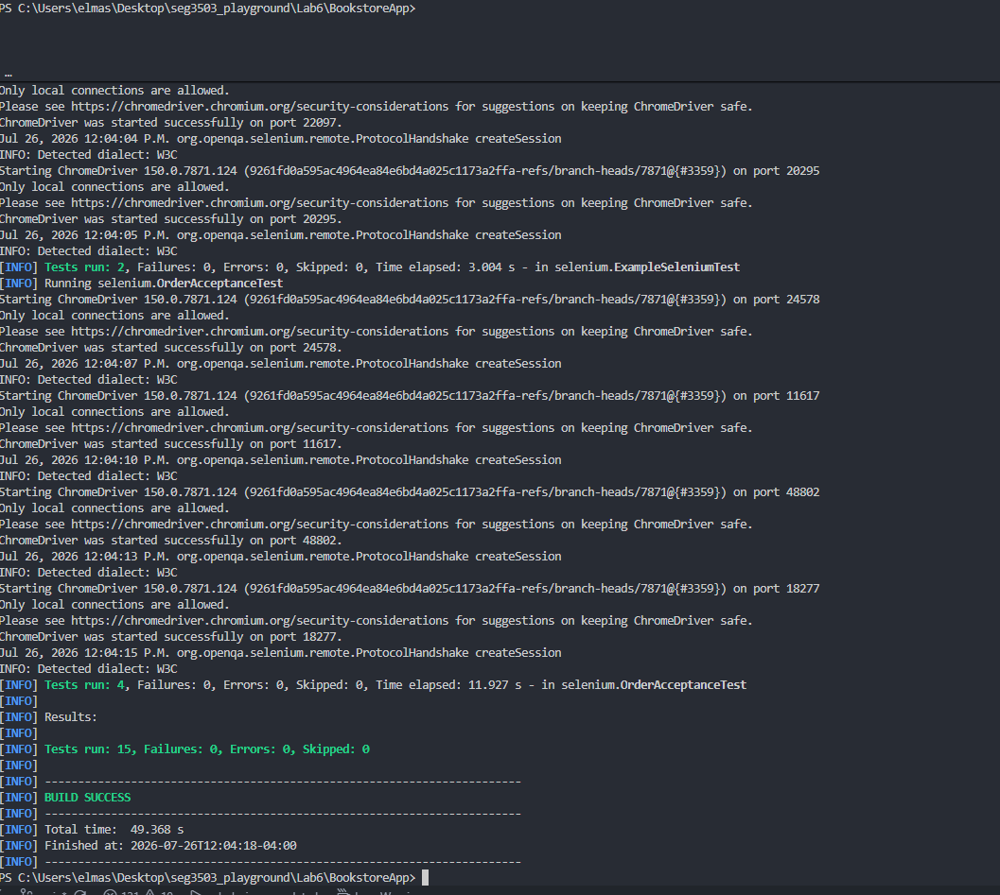

```text
[INFO] Running ExampleTest
[INFO] Tests run: 1, Failures: 0, Errors: 0, Skipped: 0, Time elapsed: 0.019 s - in ExampleTest
[INFO] Running selenium.AdminAcceptanceTest
[INFO] Tests run: 4, Failures: 0, Errors: 0, Skipped: 0, Time elapsed: 16.825 s - in selenium.AdminAcceptanceTest
[INFO] Running selenium.CategorySearchTest
[INFO] Tests run: 4, Failures: 0, Errors: 0, Skipped: 0, Time elapsed: 18.291 s - in selenium.CategorySearchTest
[INFO] Running selenium.ExampleSeleniumTest
[INFO] Tests run: 2, Failures: 0, Errors: 0, Skipped: 0, Time elapsed: 3.617 s - in selenium.ExampleSeleniumTest
[INFO] Running selenium.OrderAcceptanceTest
[INFO] Tests run: 4, Failures: 0, Errors: 0, Skipped: 0, Time elapsed: 21.002 s - in selenium.OrderAcceptanceTest
[INFO]
[INFO] Results:
[INFO]
[INFO] Tests run: 15, Failures: 0, Errors: 0, Skipped: 0
[INFO]
[INFO] ------------------------------------------------------------------------
[INFO] BUILD SUCCESS
[INFO] ------------------------------------------------------------------------
[INFO] Total time:  01:03 min
```

The test count goes from **3 to 15**, with **0 failures and 0 errors** and
`BUILD SUCCESS`. Full console output:
[`assets/mvn-test-output.txt`](assets/mvn-test-output.txt).

## 10. Notes

### Browser and driver

The tests run in **Google Chrome 150** (the browser installed on this machine),
driven by **ChromeDriver**, which **WebDriverManager** downloads and configures at
runtime:

```java
WebDriverManager.chromedriver().setup();
driver = new ChromeDriver();
driver.manage().timeouts().implicitlyWait(10, TimeUnit.SECONDS);
driver.manage().window().maximize();
```

The code shipped with the lab offers Firefox, Safari and Chrome. Firefox is not
installed here and fails with `Cannot find firefox binary in PATH`, so Chrome is
the browser that is actually used. Nothing runs headless: every test opens a real
visible Chrome window, and `driver.quit()` in `@AfterEach` makes sure no browser
process is left behind.

### Deviations from the lab slides

- **Directory name.** The work is in `Lab6/`, following the `Lab1` … `Lab6`
  naming already used by this repository, rather than `lab06/`. Screenshots are in
  `Lab6/assets/` rather than `Lab6/screenshots/`, which is where the earlier labs
  keep them.
- **JDK 25 instead of JDK 11.** An earlier version of this README said JDK 11 was
  required. That is no longer the case and was corrected: the application, the
  build and the tests were all re-run on **Oracle JDK 25.0.3**, the only JDK
  installed on this machine, and `bookstore5.jar` boots on it cleanly in about
  3 seconds.
- **WebDriverManager 5.9.2.** The version shipped with the lab material (4.x)
  predates _Chrome for Testing_ and cannot resolve a driver for Chrome 115+. 5.9.2
  downloads the matching `chromedriver` automatically. Selenium itself is left at
  the lab's pinned `3.141.59`, and the Selenium 3 API is used consistently
  (`implicitlyWait(10, TimeUnit.SECONDS)`, `new WebDriverWait(driver, 60)`).
- The macOS zip metadata (`__MACOSX`, `.DS_Store`) was removed after extraction.

### What did not work, and how it was worked around

**1. `java -jar ./target/BookstoreApp-0.1.0.jar` never served anything.** The
launcher started `bookstore5.jar` with a bare `ProcessBuilder`, which leaves the
child's output on a pipe that nothing ever reads. Spring Boot prints more during
startup than the pipe can hold, so the server blocked on `System.out` and never
reached the point where it binds port 8080 - the command appeared to hang and
`http://localhost:8080/` refused every connection. Two lines in
`src/main/java/main/App.java` fix it by sending the server's log to the launcher's
own console:

```java
pb.redirectOutput(ProcessBuilder.Redirect.INHERIT);
pb.redirectError(ProcessBuilder.Redirect.INHERIT);
```

This is the only change made to the application sources, and it is also what makes
the Spring Boot log visible in the screenshot of section 5.

**2. The starter Selenium test raced the server.** `ExampleSeleniumTest` started
the server and opened the browser immediately, which failed with
`net::ERR_CONNECTION_REFUSED` because Spring Boot needs a few seconds. The helper
`selenium/ServerControl.java` now starts `bookstore5.jar` **once** for the whole
test JVM (so test classes cannot fight over port 8080), redirects its output to a
temporary file, polls `http://localhost:8080/` until it answers `200`, and kills
the server with a JVM shutdown hook. Each test class calls
`ServerControl.ensureStarted()` in `@BeforeAll`. Apart from that one call, the
provided starter tests are untouched.

**3. Loading the welcome page empties the shopping cart.** `GET /` puts a brand
new `ShoppingCart` in the session, so a test that added a book and then navigated
back to `http://localhost:8080/` found an empty cart. Since the menu fragment (and
therefore the category search form) is part of every page, `OrderAcceptanceTest`
returns to the catalogue through the menu instead of through `/`, and the cart
survives.
