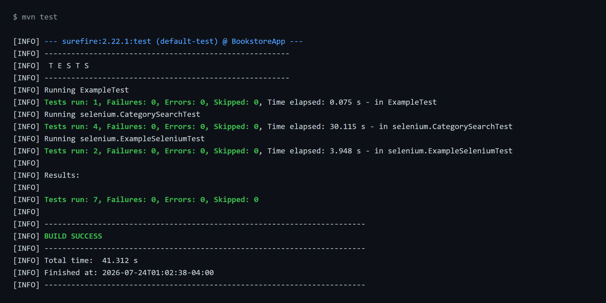

# SEG3503 - Lab 6/7 : Automated Acceptance Tests with Selenium WebDriver

| Outline | Value |
| --- | --- |
| Course | SEG 3503 |
| Date | Summer 2026 |
| Student | Alexandre Turgeon |
| Professor | Mouhcine Guennoun |
| TA | Mohamed Nefsi |

This lab drives the provided **YAMAZONE BookStore** web application with **Selenium
WebDriver** through a **Maven** project. The application is a Spring Boot server
bundled as `bookstore5.jar` (served at `http://localhost:8080`); the tests launch
that server, open Chrome, and assert on the rendered pages. The work is located in
`Teamwork/seg3503_playground/Lab6`.

```text
Lab6/
+-- BookstoreApp/            # the Maven project (extracted from BookstoreApp.zip)
|   +-- bookstore5.jar       # the bundled Spring Boot server (started by the tests)
|   +-- pom.xml
|   +-- src/test/java/
|       +-- ExampleTest.java
|       +-- selenium/ExampleSeleniumTest.java   # provided starter tests
|       +-- selenium/CategorySearchTest.java     # NEW additional tests (F2)
|       +-- selenium/ServerControl.java          # shared server bootstrap helper
+-- assets/                  # screenshots + captured mvn test output
+-- README.md
```

## Setup Notes

The lab material is from 2021, so a few adjustments were needed to run it on this
2026 machine:

- **JDK 11.** The machine's default is JDK 23, but `bookstore5.jar` is a 2019
  Spring Boot 2.1 / Tomcat 9 application. It was run and tested against **Eclipse
  Temurin JDK 11** (installed via `winget`), on which it boots cleanly.
- **Maven.** Not preinstalled; Apache Maven 3.9.11 was used, pointed at JDK 11.
- **WebDriverManager 4.0.0 → 5.9.2** (only functional `pom.xml` change).
  WebDriverManager 4.x predates *Chrome for Testing* and cannot resolve a driver
  for Chrome 115+. Version 5.9.2 automatically downloads the matching
  `chromedriver` for the installed Chrome (149 on this machine). Selenium is left
  at the lab's pinned `3.141.59`.
- The macOS zip metadata (`__MACOSX`, `.DS_Store`) was removed after extraction.

The `pom.xml` compiles at `source/target 1.8`, which JDK 11 still supports.

### Server-startup fix (`ServerControl`)

The starter `ExampleSeleniumTest` started the server with a bare `ProcessBuilder`
and immediately opened the browser. On this machine that raced Spring Boot's ~8 s
startup and failed with `net::ERR_CONNECTION_REFUSED`; the un-drained process
output could also stall startup. A small helper, `selenium/ServerControl.java`,
now:

- starts `bookstore5.jar` **once** for the whole test JVM (shared across test
  classes, so there is no port-8080 conflict between them),
- **redirects** the server output to a temp file so it never blocks,
- **polls** `http://localhost:8080/` until it answers `200` before any test runs,
- kills the server via a JVM shutdown hook.

`ExampleSeleniumTest` and `CategorySearchTest` both call
`ServerControl.ensureStarted()` in `@BeforeAll`. This is the only change to the
provided starter test.

## The additional Selenium tests (requirement F2)

The new file `CategorySearchTest.java` exercises **F2 - Browse Catalogue** (Use
Case 4). The seeded catalogue has two categories:

| Category | Books | Count |
| --- | --- | --- |
| `tech` | `hall001`, `hall002` | 2 |
| `kids` | `lewis001`, `alexander001`, `rowling001` | 3 |

Each test types a category into the search box (`#search`), clicks **Search**
(`#searchBtn`), waits for the catalogue page, and asserts on the result rows
(`div.content td[id^="title-"]`):

| Test | Requirement | Assertion |
| --- | --- | --- |
| `searchByCategoryTechReturnsMatchingBooks` | F2.1 | `tech` returns exactly 2 books (`hall001`, `hall002`) |
| `searchByCategoryKidsReturnsMatchingBooks` | F2.1 | `kids` returns exactly 3 books |
| `emptyCategoryReturnsWholeCatalogue` | F2.2 | empty category returns all 5 books |
| `unknownCategoryShowsNoMatchMessage` | UC4 alt 1.b | unknown category shows the "do not have any item matching category" message |

The `tech` test also saves `assets/home.png` and `assets/search-results-tech.png`
using Selenium's `TakesScreenshot`, so the submission screenshots are produced by
the test run itself.

## How to run

From `Lab6/BookstoreApp`, with `JAVA_HOME` pointing at JDK 11 and Maven on the
`PATH`:

```bash
mvn compile              # BUILD SUCCESS
mvn package -DskipTests  # builds target/BookstoreApp-0.1.0.jar
mvn test                 # runs all tests (starts bookstore5.jar + Chrome)
```

To run the app by hand: `java -jar bookstore5.jar` then open
`http://localhost:8080/` (customer store) or `http://localhost:8080/admin`
(admin sign-in, `admin` / `password`).

## Results

`mvn --version` on this machine:

```text
Apache Maven 3.9.11
Java version: 11.0.31, vendor: Eclipse Adoptium
OS name: "windows 10", version: "10.0", arch: "amd64", family: "windows"
```

| Command | Result |
| --- | --- |
| `mvn compile` | BUILD SUCCESS |
| `mvn package -DskipTests` | BUILD SUCCESS - `target/BookstoreApp-0.1.0.jar` produced |
| `mvn test` | **BUILD SUCCESS - Tests run: 7, Failures: 0, Errors: 0, Skipped: 0** |

The 7 tests are: `ExampleTest` (1), `ExampleSeleniumTest` (2), and the new
`CategorySearchTest` (4). Full console output: [`assets/mvn-test-output.txt`](assets/mvn-test-output.txt).

### Screenshot - passing tests (`mvn test`)



### Screenshot - application home page


### Screenshot - search by category "tech"


## Commit Map

| Step | Description |
| --- | --- |
| 1 | Add Lab6 BookstoreApp starter (extracted, cruft removed) |
| 2 | Bump WebDriverManager to 5.9.2; add `ServerControl` + wait-for-ready |
| 3 | Add `CategorySearchTest` (F2 search-by-category tests) |
| 4 | Add screenshots, captured test output, and this README |

## Submission Note

The repo is shared through `WisHonor/seg3503_playground`. The BrightSpace
submission should reference that repository and this `Lab6` directory. The
build output (`BookstoreApp/target/`) is git-ignored; `bookstore5.jar` is kept
because the tests depend on it.
